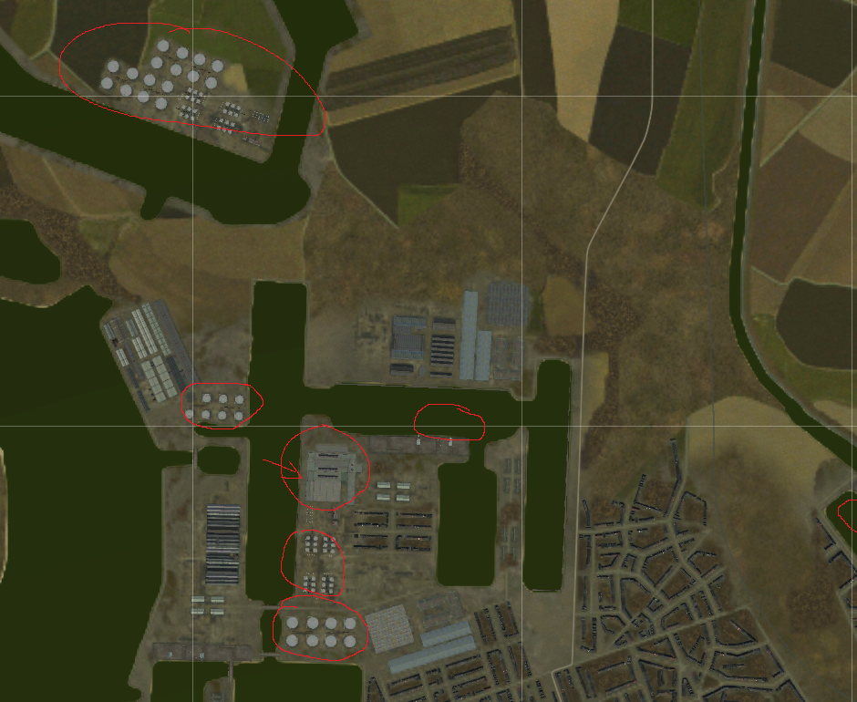

# Attaque de nuit de la zone portuaire d'Anvers

Il s'agit de détruire une usine où la wehrmacht a entreposé des munitions, avant que
celles-ci ne soient distribuées. Les autres destructions sur cette zone sont du bonus, 
mais ça risque d'être sanglant.

- Attaque de nuit, départ à 3h00. 
- Évitez les villes, et volez bas.
- la résistance devrait réussir à faire sauter un dépôt de carburant au nord de la zone 
  qui nous intéresse. Utilisez l'incendie pour vous guider.
- on s'attend à une flak intense. Ne traînez pas sur zone.
- la piste est relativement courte. Attention à votre emport.
- pour le retour, un radioguidage est disponible.

